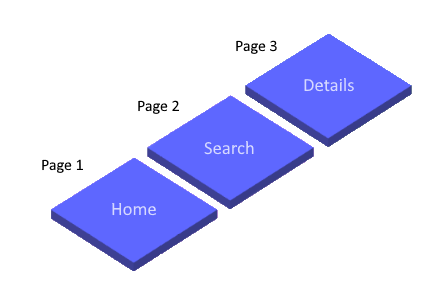
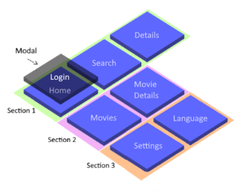
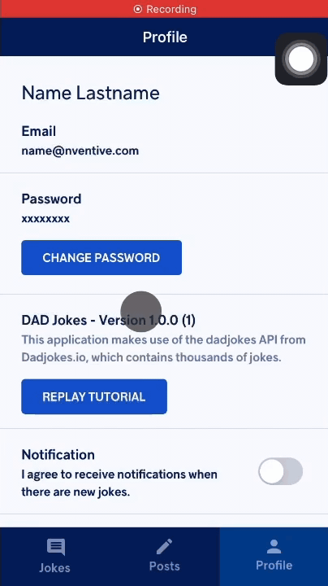
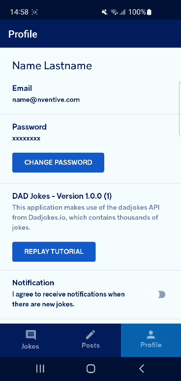
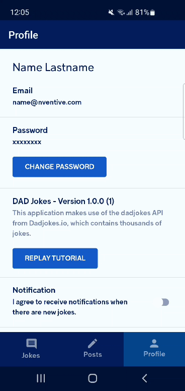
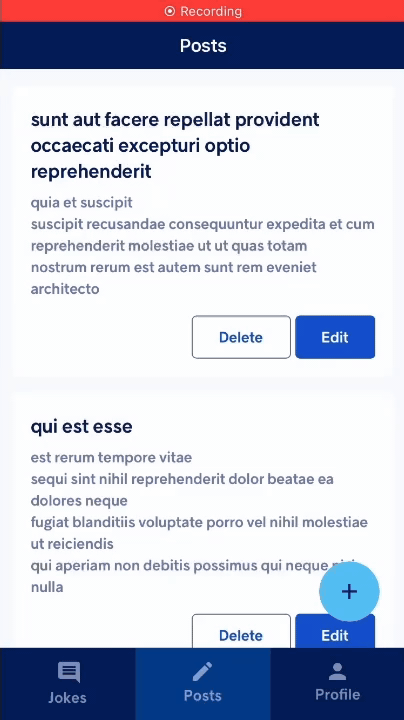
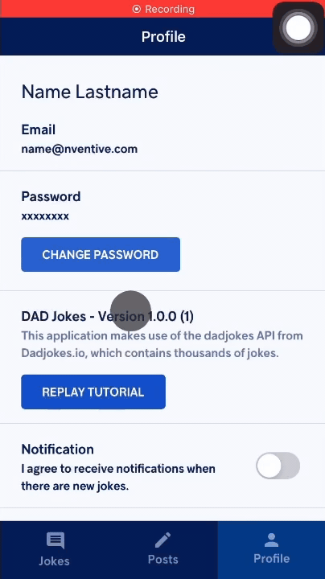
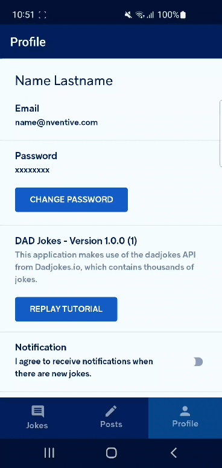

# Chinook StackNavigation and SectionsNavigation

[](LICENSE)  

This library provides unified cross-platform tools to perform ViewModel-based navigation using the [Frame](https://docs.microsoft.com/en-us/uwp/api/windows.ui.xaml.controls.frame) navigation model.
```csharp
// Navigate to the PersonDetailsPage.
await navigator.Navigate(ct, () => new PersonDetailsPageViewModel());
// Navigate back.
await navigator.NavigateBack(ct);
```

## Cornerstones
- **Highly Extensible**
  - Everything is interface-based to easily allow more implementations.
  - A single framework can't cover everything.
    Our architecture is designed in a way that allows you to integrate your favorites tools easily.
- **UI-Independant**
  - Navigation abstractions are not tied to a specific UI framework.
  - Having the navigation code in the ViewModel layer allows for reusing the same code for multiple platforms.

### More like this
The Chinook namespace has other recipes for .Net MVVM applications.
- [Chinook.DynamicMvvm](https://github.com/nventive/Chinook.DynamicMvvm): MVVM libraries for extensible and declarative ViewModels.
- [Chinook.DataLoader](https://github.com/nventive/Chinook.DataLoader): Customizable async data loading recipes.
- [Chinook.BackButtonManager](https://github.com/nventive/Chinook.BackButtonManager): Abstractions to deal with hardware back buttons.

## Before you start
Before getting started, you should understand the different navigators.

There are 2 types of navigators available:
- `IStackNavigator` - Use this if your app would use a single `Frame`.

  

- `ISectionsNavigator` - Use this if you want to use multiple frames (like sections tabs) or modals.
Note that `IStackNavigator` is used as a building block by `ISectionsNavigator`.

  

  Here is how navigation around sections and modals are related to stack navigation:
  - Dimension 1: **Stack Navigator**
    - It's linear. You can go forward or back.
  - Dimension 2: **Sections**
    - Each section is a stack navigator.
    - You can have multiple sections next to each other.
    - You can change the active section freely (without limitations).
  - Dimension 3: **Modals**
    - Each modal is a stack navigator.
    - You can have multiple modals on top of each other.
    - You can't change the modal freely; you can only open a new modal and close existing modals.
    - The active modal is always the one with the highest priority (set when opening).

  Axis | Navigator            | Operations
  :---:|----------------------|-----------
  X    | `IStackNavigator`    | Navigate, NavigateBack
  Y    | `ISectionsNavigator` | SetActiveSection
  Z    | `ISectionsNavigator` | OpenModal, CloseModal

The following steps will show how to setup the `ISectionsNavigator`.
> 💡 If you want to create a single stack application, check [this doc](docs/StackNavigation-Setup.md) instead.

## Getting Started

1. Install the latest version of `Chinook.SectionsNavigation.Uno` or `Chinook.SectionsNavigation.Uno.WinUI` in your project.

1. Create a base class that implements `INavigableViewModel` for your ViewModels.

   You can use the MVVM framework of your choice.
   In this sample, we use `ViewModelBase` from [`Chinook.DynamicMvvm`](https://github.com/nventive/Chinook.DynamicMvvm).
   ```csharp
   using Chinook.DynamicMvvm;
   using Chinook.StackNavigation;
   using Windows.UI.Xaml.Controls;
   namespace ChinookSample
   {
     public class ViewModel : ViewModelBase, INavigableViewModel
     {
       public void SetView(object view)
       {
         // For Chinook.DynamicMvvm, we want to create an MVVM dispatcher using the CoreDispatcher of the Page.
         Dispatcher = new CoreDispatcherDispatcher((Page)view);
       }
     }
   }
   ```

1. Map your ViewModels to Pages.
   
   Create a method returning a dictionary associating the types.
   You can put that method in `App.xaml.cs`.
   ```csharp
   private static IReadOnlyDictionary<Type, Type> GetPageRegistrations() => new Dictionary<Type, Type>()
   {
     // Assuming that MainPageViewModel is a class that inherits from the ViewModel class of the previous step.
     { typeof(MainPageViewModel), typeof(MainPage) }
   };
   ```

1. Add a `MultiFrame` at the root of your application's XAML.
   
   You can do this in various ways.
   We suggest you create a `UserControl` which contains the `MultiFrame` and set that `UserControl` as the content of the application's `Window`.
   
   Here's a minimal example:
   ```xml
   <UserControl x:Class="ChinookSample.Shell"
                xmlns="http://schemas.microsoft.com/winfx/2006/xaml/presentation"
                xmlns:x="http://schemas.microsoft.com/winfx/2006/xaml"
                xmlns:nav="using:Chinook.SectionsNavigation">
     <Grid>
       <nav:MultiFrame x:Name="NavigationRoot"
                      CommaSeparatedSectionsFrameNames="Home,Settings"/>
    </Grid>
   </UserControl>
   ```
   Make sure you publicly expose the `MultiFrame` instance from the code behind of your `UserControl`.

   ```csharp
   using Windows.UI.Xaml.Controls;
   using Chinook.SectionsNavigation;

   namespace ChinookSample
   {
     public sealed partial class Shell : UserControl
     {
       public Shell()
       {
         this.InitializeComponent();
       }

       public MultiFrame MultiFrame => NavigationRoot;
     }
   }
   ```

1. Adjust the `OnLaunched` of your `App.xaml.cs` so that it does the following.
   - Set your newly added `Shell` as the content of the window.
   - Create a `FrameSectionsNavigator` using the `MultiFrame` from the `Shell` and the page registrations.
   - Do an initial navigation to display a page.
   ```csharp
   protected override void OnLaunched(LaunchActivatedEventArgs e)
   {
      var root = Window.Current.Content as Shell;
      if (root == null)
      {
        // Set the Shell as the window content.
        root = new Shell();
        Window.Current.Content = root;
        
        // Create the navigator
        var navigator = new FrameSectionsNavigator(
          multiFrame: root.MultiFrame,
          globalRegistrations: GetPageRegistrations()
        );          

        // Do an initial navigation
        _ = navigator.SetActiveSection(CancellationToken.None, "Home", () => new MainPageViewModel());
      }      
      
      Window.Current.Activate();
   }
   ```

1. Start your application!

   From there you probably want to publicly expose the your `ISectionsNavigator` instance to your ViewModels so that they can manipulate the navigation.
   You can do that using the pattern of your choice.

## Features

### Stack Navigation
Stack navigation is the basic pattern for navigating forward and back.
It's reused in both sections and modals.

#### Navigate forward and back
```csharp
// Navigate to the PersonDetailsPage.
await navigator.Navigate(ct, () => new PersonDetailsPageViewModel());
// Navigate back.
await navigator.NavigateBack(ct);
```

#### iOS back gesture
The back swipe gesture is supported on iOS devices when using `FrameStackNavigator`.


#### Navigate forward, clearing the backstack
This can be useful when you don't want the user to be able to navigate back.
```csharp
// Navigate to the HomePage, clearing all other previous pages from the backstack.
await navigator.NavigateAndClear(ct, () => new HomePageViewModel());
```

#### Remove previous pages
```csharp
// Navigate to Step 1
await navigator.Navigate(ct, () => new Step1PageViewModel());
// Navigate to Step 2
await navigator.Navigate(ct, () => new Step2PageViewModel());
// Navigate to Step 2.1
await navigator.Navigate(ct, () => new Step21PageViewModel());
// Navigate to Step 3
await navigator.Navigate(ct, () => new Step3PageViewModel());

// Remove the previous page (Step 2.1) from the backstack.
await navigator.RemovePrevious(ct);
// Navigate back to Step 2
await navigator.NavigateBack(ct);
```

### Observe the StackNavigator's State
You can access the stack navigator's state using `IStackNavigator.State`.
It gives you access to the navigation stack as well as the last request.
You can observe the state with the `IStackNavigator.StateChanged` event.

### Sections
Sections are independent stacks that live next to each other.
Only 1 section can be active at a time.
Apps that have a bottom navigation bar typically would use 1 section per bottom bar button and perhaps another for the login pages.

#### Change between sections
```csharp
// Go to Home section.
await sectionsNavigator.SetActiveSection(ct, "Home");
// Go to Messages section.
await sectionsNavigator.SetActiveSection(ct, "Messages");
// Go to Settings section.
await sectionsNavigator.SetActiveSection(ct, "Settings");
```

#### Return to root of section
This can be useful to simply reset a section when returning to it.

```csharp
// Go to Home section.
await sectionsNavigator.SetActiveSection(ct, "Home", () => new HomePageViewModel());
// Navigate forward to some details page in the Home section.
await sectionsNavigator.Navigate(ct, () => new PersonDetailsPageViewModel());
// Go to Messages section.
await sectionsNavigator.SetActiveSection(ct, "Messages");

// Return to Home section on the Home page, not the PersonDetails page.
await sectionsNavigator.SetActiveSection(ct, "Home", () => new HomePageViewModel(), returnToRoot: true);
```

> 💡 When tapping on a bottom section button, some applications have a dual behavior:
> 1. Tap once: the app returns to that section.
> 1. Tap a second time: the section returns to its root.
>
> `ISectionsNavigator.SetActiveSection` supports such behavior.

#### Navigate in an inactive section
You can navigate in sections that are not active.
This is useful if you want to _prepare_ a section before entering it to have smooth transitions.

```csharp
// Go to Home section.
await sectionsNavigator.SetActiveSection(ct, "Home", () => new HomePageViewModel());
// Get the settings section navigator.
var settingsSection = sectionsNavigator.State.Sections["Settings"];

// Navigate forward to the SettingsPage, then the LicencePage in the Settings section.
// The Settings sections is not currently active, so you don't actually see this change happen.
await settingsSection.Navigate(ct, () => new SettingsPageViewModel());
await settingsSection.Navigate(ct, () => new LicencePageViewModel());

// Go to Settings section to see the Licence page.
await sectionsNavigator.SetActiveSection(ct, "Settings");
// Navigate back to SettingsPage.
await sectionsNavigator.NavigateBack(ct);
```

### Modals
`ISectionsNavigator` allows you to handle multiple stacks of navigation in your app, including modals.
Modals are navigation stacks that show up on top of all other sections.
A modal stack behaves like any other section, meaning you can navigate back and forth in it.
Your app can also navigate the pages behind the modals, without breaking the flow.

#### Open and close modals
```csharp
// Open LoginPage in a modal.
await sectionsNavigator.OpenModal(ct, () => new LoginPageViewModel());
// Close the modal.
await sectionsNavigator.CloseModal(ct);
```

#### Open modals behind other modals
It's possible to open a modal behind a modal that's already open.
This can be useful to show an optional extra step in a modal flow, while keeping nice transitions.
```csharp
// Open LoginPage in a modal with a priority of 2.
await sectionsNavigator.OpenModal(ct, () => new LoginPageViewModel(), priority = 2);

// Open the SurveyPage in a modal behind the LoginPage page modal, using a lower priority of 1.
// Because the SurveyPage opens with a lower priority, you don't actually see this change happen.
await sectionsNavigator.OpenModal(ct, () => new SurveyPageViewModel(), priority = 1);

// Close the top-most modal (LoginPage) to reveal the SurveyPage modal behind it.
await sectionsNavigator.CloseModal(ct);
```

#### Change sections behind modals
You can navigate in sections that are not active.
This is useful if you want to _prepare_ a section before entering it.

```csharp
// Open LoginPage in a modal.
await sectionsNavigator.OpenModal(ct, () => new LoginPageViewModel());

// Change the section to Messages.
// Modals are displayed on top of sections, so you don't actually see this change happen.
await sectionsNavigator.SetActiveSection(ct, "Messages", () => new MessagesPageViewModel());

// Close the modal to reveal the Messages section.
await sectionsNavigator.CloseModal(ct);
```

#### Navigate back or close modal
There are handy extension methods on `ISectionsNavigator` to easily check whether you can navigate back or close a modal.
This can be useful when dealing with an hardware back button.
```csharp
// Check whether the navigator can navigate back or close a modal.
if (sectionsNavigator.CanNavigateBackOrCloseModal())
{
  // Navigates back within the modal if the modal has multiple pages in its stack
  // Or closes the modal if there's a modal that has an empty backstack
  // Or navigates back in the active section.
  await sectionsNavigator.NavigateBackOrCloseModal(ct);
}
```

#### Support Screen Reader
Consider setting `MultiFrame.CollapsePreviousFrameWhenOpeningModals` to `true` to prevent previous frames (behind modals) from being focusable.

### Observe the SectionsNavigator's State
You can access the sections navigator's state using `ISectionsNavigator.State`.
It gives you access to all section stacks and modal stacks as well as the last request.
You can observe the state with the `ISectionsNavigator.StateChanged` event.

### Ready for Dependency Injection
The two navigation services are made from simple interfaces.
You can easily leverage containers such as Microsoft's [Generic Host](https://docs.microsoft.com/en-us/aspnet/core/fundamentals/host/generic-host).
Here is an example that registers and retrieves the `ISectionsNavigator` using  `Microsoft.Extensions.DependencyInjection` and `Microsoft.Extensions.Hosting`.

```csharp
var serviceProvider = new HostBuilder()
  .ConfigureServices(serviceCollection => serviceCollection
    .AddSingleton<ISectionsNavigator>(new FrameSectionsNavigator(
      multiFrame: root.MultiFrame,
      globalRegistrations: GetPageRegistrations()
    ))
  )
  .Build()
  .Services;
			
var navigator = serviceProvider.GetService<ISectionsNavigator>();
```

### Ready for Integration Testing
Because this is ViewModel-based navigation and the navigator interfaces don't reference any UI type, you can use the navigators in **Test Projects** or **Console Applications** without changing your navigation logic
Just install the `Chinook.SectionsNavigation` or `Chinook.StackNavigation` packages and use the `BlindSectionsNavigator` or `BlindStackNavigator` implementations.

### Built-in Debounce
Implementations of both `IStackNavigator` and `ISectionsNavigator` have a built-in debounce mechanism that prevents _double navigations_.
If you invoke 2 operations simultaneously (double tap, press 2 buttons with 2 fingers, etc.), only the first will actually run.
This is because the request state (Processing, Processed or FailedToProcess) is part of the `ISectionsNavigator.State`.
If a request is made while another is processing, the second request is cancelled.

### Transitions and Animations
There are five statically available built-in transitions in `FrameSectionsTransitionInfo`.
- `FrameSectionsTransitionInfo.SuppressTransition`
- `FrameSectionsTransitionInfo.FadeInOrFadeOut`
- `FrameSectionsTransitionInfo.SlideUp`
- `FrameSectionsTransitionInfo.SlideDown`
- `FrameSectionsTransitionInfo.NativeiOSModal` (available on iOS only)

#### Stack navigation
The platform's default transition is used. Here are examples for iOS and Android respectively.


<br /><br />


You can also suppress the default transitions using `StackNavigatorRequest.SuppressTransitions`.

```csharp
await navigator.Navigate(ct, () => new ResetPasswordPageViewModel(), suppressTransition: true);
```

Here is an example of the result on Android.


<br /><br />

#### Section navigation

You can customize or remove the section navigation animations using `SectionsTransitionInfo`. 
The default transition is `FrameSectionsTransitionInfo.FadeInOrFadeOut`. 
Here is an example on iOS.



You can specify transition info per request using `SectionsNavigatorRequest.TransitionInfo`.

```csharp
await _sectionsNavigator.SetActiveSection(
  ct,
  SectionsNavigatorRequest.GetSetActiveSectionRequest(
    sectionName: "Settings",
    transitionInfo: FrameSectionsTransitionInfo.SuppressTransition
  )
);
```

You can also specify section navigation transition info globally using the following when instanciating `FrameSectionsNavigator`:

```csharp
var navigator = new FrameSectionsNavigator(root.MultiFrame, GetPageRegistrations())
{
  DefaultSetActiveSectionTransitionInfo = FrameSectionsTransitionInfo.SuppressTransition
};
```

#### Modals

You can customize or remove the modals opening and closing animations using `SectionsTransitionInfo`.
The default modal transition for iOS is its native one, used by `FrameSectionsTransitionInfo.NativeiOSModal`.



For the other platforms, the default modal opening transition is `FrameSectionsTransitionInfo.SlideUp` and the default modal closing transition is `FrameSectionsTransitionInfo.SlideDown`.


You can specify transition info per request using `SectionsNavigatorRequest.TransitionInfo`. 

```csharp
await navigator.OpenModal(
  ct,
  SectionsNavigatorRequest.GetOpenModalRequest(
    StackNavigatorRequest.GetNavigateRequest(() => new ResetPasswordPageViewModel()),
    transitionInfo: FrameSectionsTransitionInfo.FadeInOrFadeOut,
    newModalClosingTransitionInfo: FrameSectionsTransitionInfo.FadeInOrFadeOut
  )
);
```

You can also specify modal opening and closing transitions info globally using the following when instanciating `FrameSectionsNavigator`:

```csharp
var navigator = new FrameSectionsNavigator(root.MultiFrame, GetPageRegistrations())
{
  DefaultOpenModalTransitionInfo = FrameSectionsTransitionInfo.FadeInOrFadeOut
  DefaultCloseModalTransitionInfo = FrameSectionsTransitionInfo.FadeInOrFadeOut
};
```

This is what the `FrameSectionsTransitionInfo.FadeInOrFadeOut` transition for modals looks like on Android.


<br /><br />

#### Custom animations

You can also create custom animations using the following classes:
- `DelegatingFrameSectionsTransitionInfo`
  - Available on all platforms.
  - Allows you to create a transition in an async method where you can animate using `Storyboard`.
- `UIViewControllerTransitionInfo`
  - Available on iOS only.
  - Allows you to customize the native behavior (such as dismissability via gestures and animations).


## Breaking Changes

Please consult [BREAKING_CHANGES.md](BREAKING_CHANGES.md) for more information about migration.

## License

This project is licensed under the Apache 2.0 license - see the
[LICENSE](LICENSE) file for details.

## Contributing

Please read [CONTRIBUTING.md](CONTRIBUTING.md) for details on the process for
contributing to this project.

Be mindful of our [Code of Conduct](CODE_OF_CONDUCT.md).